<!-- portfolio:start -->
<p align="center">
  
</p>

<h1 align="center">Aura Motion Kit</h1>

<p align="center"><strong>A soft interaction kit for pastel motion, tactile buttons, floating tags, and tiny sounds.</strong></p>

<p align="center">

  
  
</p>

## Aura Signature

This one is the gentle visual language: soft gradients, friendly motion, little sound feedback, and mobile-first interface pieces.

## Use It For

Starting points for personal tools, playful forms, onboarding screens, and warm AI-adjacent interfaces.

## Run

Open `index.html` or run `npm run serve`.

## Portfolio Note

This repository has its own visual identity inside the portfolio. The goal is that every project feels like a different product, not another copy of the same template.
<!-- portfolio:end -->

---

## Existing Project Notes

# Aura Motion Kit

Aura Motion Kit is a small front-end style system for soft, expressive, mobile-first interfaces. It packages the visual language into a reusable static demo: pastel gradients, floating labels, glass panels, tactile buttons, ambient canvas particles, sound feedback, and motion-safe microinteractions.

## What it includes

- Mobile-first layout with responsive desktop support
- Pastel aura background system
- Floating badge layer
- Pressable buttons with sound and haptic-friendly timing
- Card reveal and tilt interactions
- Web Audio sound engine without external files
- Reduced-motion support
- Copyable design tokens

## Run

```bash
npm run check
npm run serve
```

Open `http://127.0.0.1:5286`.

## Reuse

The style is also saved at `C:\Freddy_Style_Kit` as a reusable base for future projects.
